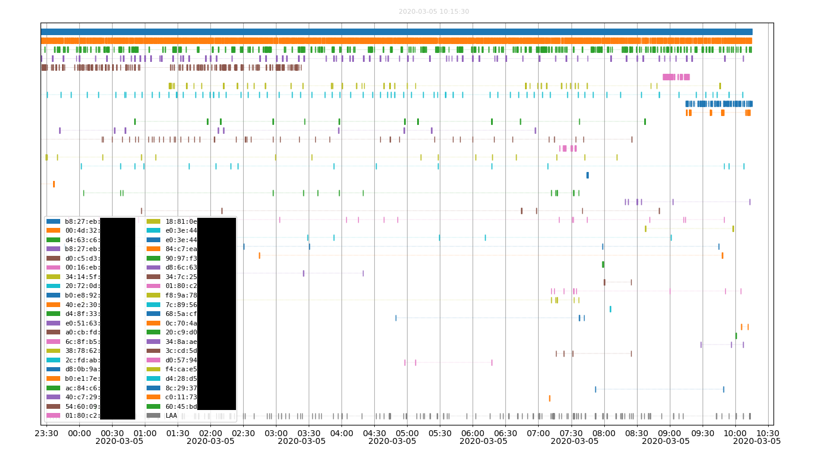

# kismet_timeplot
Tool to plot a timeline of wifi packets captured with kismet

This python script uses *matplotlib* to draw a chart with the activity of each devices (by mac addresses) captured by *kismet*. It draws a timeline for each wifi mac addresses with a marker at the time a packet has been captured.

It opens an interactive *matplotlib* window if no output image is specified.

    usage: kismet_timeplot.py [-h] [-b DB] [-i [IMAGE]] [-l] [--label]
                              [-k KNOWNMAC] [-M MIN] [-m MAC] [-p] [-r RSSI]
                              [-s START] [--time-span TIME_SPAN] [-t [TITLE]] [-v]
    
    Plot a timeline of devices' activity as captured by kismet
    
    optional arguments:
      -h, --help            show this help message and exit
      -b DB, --db DB        file name of the kismet db
      -i [IMAGE], --image [IMAGE]
                            output an image
      -l, --legend          add a legend
      --label               add a mac label for each plot
      -k KNOWNMAC, --knownmac KNOWNMAC
                            known mac to highlight in red
      -M MIN, --min MIN     minimum number of packets for device to be plotted
      -m MAC, --mac MAC     only display that mac
      -p, --privacy         merge LAA MAC address
      -r RSSI, --rssi RSSI  minimal value for RSSI
      -s START, --start START
                            start timestamp
      --time-span TIME_SPAN
                            time span (coud be #d or ##h or ###m)
      -t [TITLE], --title [TITLE]
                            add a title to the top of image (if none specified,
                            use a timestamp)
      -v, --verbose         be verbose

By default, it plots the last **24 hours**. So if your capture is older than that, you need to specify a start time (with `-s` or `--start`) and possibly a time span (with `--time-span`)
